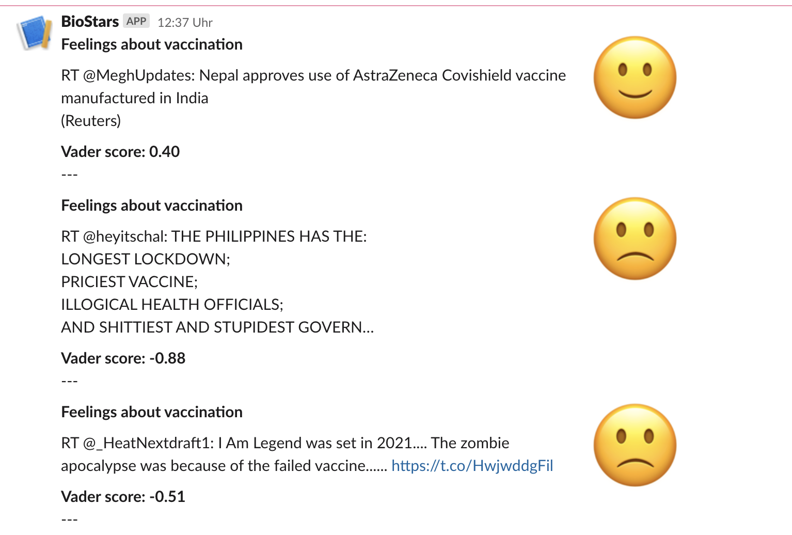

# Tweetbot-Pipeline

## Summary
Dockerized pipeline that collects tweets from Twitter related to a chosen topic and stores them in MongoDB, analyzes the sentiment of each tweet, stores analyzed tweets in PostgresDB and posts tweets with sentiment score binned as positive, neutral or negative to a slack channel.

## Containers

### 1. Tweet-collector:
* uses Tweepy package to handle twitter credentials (API keys and tokens)
* listen to tweets - filters by a given keyword
* inserts filtered tweets into MongoDB
### 2. ETL job
* EXTRACTs tweets from MongoDB
* TRANSFORM: uses VADER model to analyze the sentiment of tweet-texts
* LOAD: creates a Postgres DB storing tweets with according VADER score and sentiment binned into positive, negative and neutral
### 3. Slackbot
* queries Postgres DB for latest tweet
* posts tweet + VADER score + Smiley according to positive, negative, neutral sentiment to Slack channel at a given time interval

